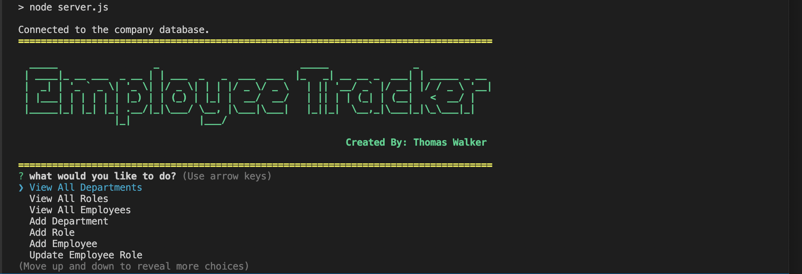

# Employee-directory-12

;

## Description 

This application is run in node.js and is framed by the Inquirer package to interact with a MySQL database. The Database is a model
                

## Table of Contents

* [Installation](#installation)
* [Usage](#usage)
* [Credits](#credits)
* [License](#license)
* [Contributing](#Contributing)
* [Contact](#Contact)
* [Presentation](#Presentation)

## Installation

 ### Technologies Used:
  Node.js, 
  MySQL, 
  Inquirer.js, 
  console.table,
  chalk, 
  figlet 

## Usage 

Start this app by Opening the command line and executing ' npm start' or 'node server.' 
The User will then receive a menu prompt. 
Follow the directions of each prompt object to navigate the application and receive a graphical response in the terminal window

## Credits

Thomas Walker 

## License

## Contributing

    

## Tests
No test modules were used in the build process of this application 

## Contact

 github.com/twalker7

 ## Presentation
 ### Attached is a link to video presentation for this application:
https://watch.screencastify.com/v/KaaPFlaU8bf3QTtK0WLO
 

